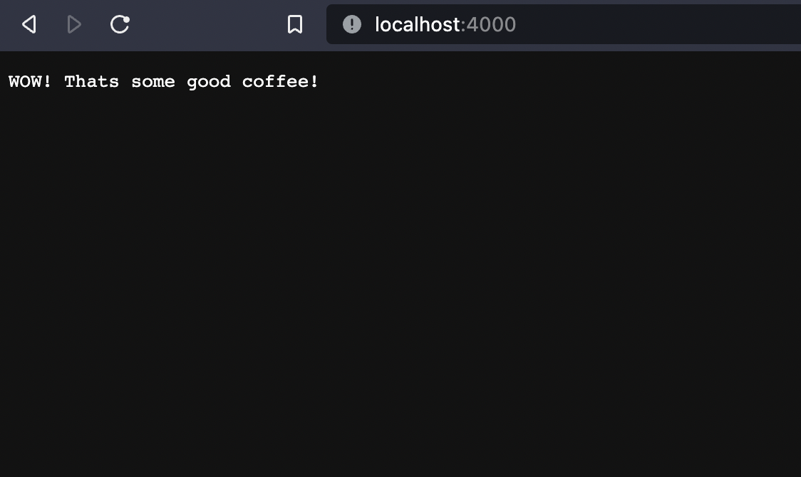

<h1 id='get-started'>getting started with Node.JS</h1>
Full stack includes client side and server side, the client side being the front end of the application can be coded with React, while server side would be coded in a back end language like Java, python, or Node.JS # *which we will be focusing on now*

- The front end and back end communicate using JSON Payloads.

- node.js is an open source, cross platform language so it is very popular in software engineering

- node.js runs on Google's  ***V8 engine***, the same engine which processes chrome's code into lower level machine language.

- it is Asynchronous, non-Blocking and Single threaded ( while awaiting a response from a process, it does other tasks, appears multi-threaded)

#

## Json payload
- Json stands for JavaScript Object Notation
- - A list of key value pairs: 
>{
>'color': 'red', 'brand':'Jeep'
>}

color and brand being keys and red and Jeep being values.
#

## Express Framework
- Express helps in the creation of API (application programing interface) end points

#

***make sure you have the latest version of Node.JS downloaded
https://nodejs.org/en/download/***

# creating a web server with Node.JS
to create a web server using node, instantiate the server with:

    const http = require('http');

    let server = http.createServer(function(request,response){})

The web server is stored in the server variable. The create server function accepts a callback function. this function is optional.

the callback function is what handles the json request messages and also the response.

    let server = http.createServer(function(request,response){
        let body = 'WOW! Thats some good coffee.;

        response.writeHead(200,{
            'content-length': body.length,
            'content-type': 'text/plain'
        })
        response.end(body);
    });

now we just need to make the server listen to a specific port so we can use it! In this case we are using port 4000. And the following line is added after the instance of the server (the last line in the code)

    server.listen(4000);

The above is put together in a JS file in the same repository.

## running the server
the following is for Unix systems (mac), windows may have slight differences

 go to the containing directory and in the terminal enter 
>node get-started.js

go to http://localhost:4000/ in your browser and you should see the following

Congratulations! you've made your very own Node.js Server!

