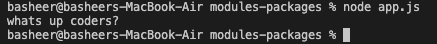
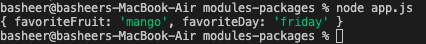

# Modules and Packages
* [What is a Package?](#whatModule)

- [How to import a module](#how-to-import)

- [How to import an object](#how-to-import-objects)

- [How to import a function](#how-to-import-functions)

---

<h1 id='whatModule'> what are packages?</h2>

A package contains multiple modules (blocks of code) that we can import into our Node.JS project. 

We can make our own blocks of code and import them from other files or use the many packages which are ready to be used.

***NPM*** (node package manager, downloaded with Node js) is software which manages packages and lets you download them with ease.

These packages have a JSON file usually with the name, version number license etc of the package.

---
---
<h1 id='how-to-import'>How to import a module</h2>

where are we importing the module? 
in most cases it would be an app.js or index.js file. There is an app.js file within this folder if you want a quick example. 

>the modules can be imported using the ***require*** function   
    which we used to import the HTTP package in the previous section:

    const http = require('http');

- You can create your own modules and increase the complexity much more later on, but for now i will give a simple example using a string literal.

>*A simple JS module "exportStringLiteral.js"*

        module.exports = 'whats up coders?';

>now we import the module into the app.js file using the ***require*** function from within app.js.

    const simpleScript= require('./exportStringLiteral')

    console.log('simple Script:', simpleScript)

## Lets test it out!
in your terminal, within the modules-packages folder of this repository, enter "node app.js" this will console.log the string literal from our "exportStringLiteral.js" file. 

> Remember, the node is running! when you are done using a node use keys control and C to terminate the node
---

<h2 id='how-to-import-objects'>How to import an object</h2>

 i made a seperate script file called 'exportObject.js

    exports.favoriteFruit= 'mango'

    module.exports.favoriteDay='friday'

>Above you see the shorthand and below it is the longer form, both achieve the same goal

> The key value pairs are being added on to the exports object.

 now we will import the object by adding the following code to app.js 

    const objectScript=require('./exportObject')
    console.log('object Script:', objectScript)

>the above is the second code block in app.js, uncomment and try it out, or make your own version in a seperate file.

Again, to run the server you can enter the following in the terminal while in the folder of the file you want to use :
    
    node app.js
>node  (file name of server)

---

<h2 id='how-to-import-functions'>How to import a function</h2>

this is a simple function which just console logs the input

    module.exports.myFunction = function (message){
        console.log('my function:',message)
    };    

>same process as the other imports, we just treat it like a function in the app.js file.*

to import the function we follow the same process in app.js

    const functionScript= require('./exportFunction')
    functionScript.myFunction('is this thing working?')

